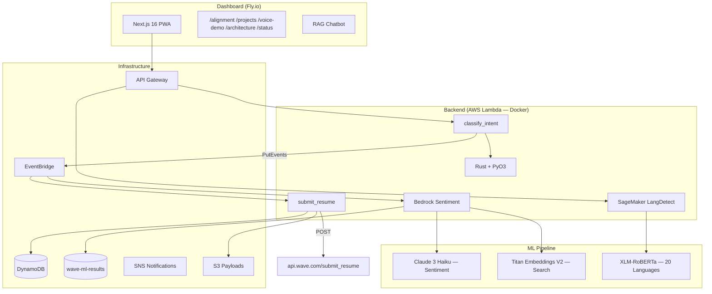

# Wave Application — Senior ML Engineer (LLM & Voice)

[](https://github.com/ericgitangu/wave/actions/workflows/ci.yml)
[](LICENSE)
[](backend/)
[](infra/)
[](dashboard/)
[](https://upstash.com)

Polyglot submission for Wave's Senior Machine Learning Engineer role. Ships a working product as the application itself.

## Architecture



## AWS Backend Services

| Service | What it does | Why |
|---------|-------------|-----|
| Voice Lambda | Tokenizes input, detects language (Swahili/English), classifies mobile money intent (check_balance, send_money, etc.) | Core Wave feature — voice/chat classification for mobile money support |
| Submission Lambda | POSTs resume JSON to Wave's API, logs to DynamoDB, publishes to EventBridge | The actual job application mechanism |
| Bedrock Titan | Generates 256-dim embeddings for semantic search across support tickets | Search/similarity for support message routing |
| Bedrock Claude 3.5 Haiku | Sentiment analysis (positive/negative/neutral) + complaint classification via US inference profile | Understanding customer sentiment at scale |
| SageMaker | XLM-RoBERTa model detecting 20 languages (incl. Swahili, Wolof, French) | Wave operates across West/East Africa — language detection is critical |

**Endpoints (post-deploy):**

```
Voice API:      https://96lch8ou19.execute-api.us-east-1.amazonaws.com
LangDetect API: https://dzl1p5fct7.execute-api.us-east-1.amazonaws.com
Bedrock Lambda: wave-bedrock-sentiment
SageMaker:      wave-lang-detect (ml.m5.large — auto-stop after 59min)
```

## Submission

The core deliverable — POST a JSON resume to Wave's API:

```python
# scripts/submit.py
ENDPOINT = "https://api.wave.com/submit_resume"
# Bearer token: wave_{country_code}_{any_chars}
DEFAULT_TOKEN = "wave_KE_ericgitangu"
```

The PWA dashboard pulls the same payload and renders it as interactive cards:

```typescript
// dashboard/src/app/api/submissions/route.ts
export async function GET() {
  return NextResponse.json({
    submissions: [{
      id: crypto.randomUUID().slice(0, 8),
      timestamp: '2026-02-24T00:00:00Z',
      status: 'acknowledged',
      endpoint: 'https://api.wave.com/submit_resume',
    }],
  })
}
```

## Structure

```
payload/resume.json            JSON payload for Wave API
scripts/
  submit.py                    Standalone submission (no infra needed)
  build-lambdas.sh             Full build + deploy pipeline
  sagemaker-scheduler.sh       Auto-start/stop (59min cap)
  teardown-sagemaker.sh        Manual teardown
backend/
  src/lib.rs                   PyO3 module registration (6 functions)
  src/submission.rs            Rust-native HTTP POST via reqwest
  src/voice.rs                 Tokenization + language detection (Swahili/English)
  src/bedrock.rs               Bedrock request/response serialization
  src/sagemaker.rs             SageMaker request/response serialization
  python/handler.py            Submission Lambda handler
  python/voice_handler.py      Voice classification + EventBridge publish
  python/bedrock_handler.py    Bedrock sentiment + embeddings Lambda
  python/sagemaker_handler.py  SageMaker language detection Lambda
  Dockerfile.lambda            Multi-stage Rust+PyO3 Docker build
  tests/                       pytest + Rust #[cfg(test)]
dashboard/
  app/                         Next.js 16 App Router pages
  components/                  SplashBanner, WhatsNew, SystemStatusCharts, etc.
  src/data/meta.json           Metafile driving all app identity, SEO
  src/context/                 AppStatusContext (30s polling, 6-service health), ProvisioningContext
  src/components/Footer.tsx    Persistent footer with links
  src/components/VCardPanel.tsx Downloadable vCard overlay
  src/components/GlobalSearch.tsx Cmd+K full-width search with voice input
  src/components/ProvisioningGate.tsx Status-aware warm-up gate
infra/
  lib/submission-stack.ts      DynamoDB + Lambda + EventBridge + SNS + S3
  lib/voice-stack.ts           Lambda + API Gateway + EventBridge publish
  lib/bedrock-stack.ts         DynamoDB + Bedrock Lambda + EventBridge rules
  lib/sagemaker-stack.ts       SageMaker endpoint + Lambda + API Gateway
```

## Quick Start

```bash
# Run all Rust tests (22 tests)
make test

# Build Docker image locally
make build

# Deploy to AWS (build + push + CDK)
make deploy

# Start SageMaker endpoint (auto-stops in 59min)
make sagemaker-start

# Stop SageMaker immediately
make sagemaker-stop

# Dashboard dev server
make dashboard-dev
```

## Local Development

### Prerequisites

| Tool | Version | Install |
|------|---------|---------|
| Node.js | 20+ | `brew install node@20` |
| pnpm | 10+ | `corepack enable && corepack prepare pnpm@latest --activate` |
| Rust | 1.77+ | `curl --proto '=https' --tlsv1.2 -sSf https://sh.rustup.rs \| sh` |
| Python | 3.12 | `brew install python@3.12` |
| Docker | 24+ | [Docker Desktop](https://docker.com/products/docker-desktop) |
| AWS CLI | v2 | `brew install awscli` |
| Fly CLI | latest | `brew install flyctl` |

### Dashboard (Next.js)

```bash
cd dashboard
pnpm install
pnpm dev          # http://localhost:3000
pnpm build        # production build (standalone output)
pnpm lint         # ESLint
pnpm exec tsc --noEmit  # type check
```

### Dashboard Docker (production-like)

```bash
# Build and run the dashboard container locally
docker build -t wave-dashboard:local ./dashboard
docker run --rm -p 3000:3000 wave-dashboard:local
# Visit http://localhost:3000
```

### Backend (Rust + PyO3)

```bash
cd backend

# Rust tests — requires Python 3.12 (PyO3 0.23 does not support Python 3.14)
# If your system default is Python 3.14, create a venv first:
python3.12 -m venv .venv && source .venv/bin/activate

export PYO3_USE_ABI3_FORWARD_COMPATIBILITY=1
cargo test --release

# Or build + test inside Docker (recommended, matches CI):
docker build -f Dockerfile.lambda --platform linux/amd64 -t wave-lambda:ci .
```

### Python tests

```bash
cd backend
pip install -r requirements.txt   # boto3, pytest, mypy, moto
python -m pytest tests/ -v
mypy python/
```

> **Note:** On macOS with system Python 3.14+, `pip install` is blocked by PEP 668. Use a virtual environment: `python3.12 -m venv .venv && source .venv/bin/activate`

### Infrastructure (CDK)

```bash
cd infra
npm install
npx tsc --noEmit   # type check
npx cdk synth      # validate CloudFormation templates
npx cdk deploy --all --require-approval never  # deploy (needs AWS creds)
```

### Environment Variables

```bash
# dashboard/.env.local
ANTHROPIC_API_KEY=sk-ant-...              # Claude API key for RAG chatbot
NEXT_PUBLIC_VOICE_API_URL=...             # Voice API Gateway URL (from AWS deploy)
UPSTASH_REDIS_REST_URL=https://...        # Upstash Redis REST URL (free tier)
UPSTASH_REDIS_REST_TOKEN=...              # Upstash Redis REST token
```

For production (Fly.io), set secrets:

```bash
flyctl secrets set \
  ANTHROPIC_API_KEY="sk-ant-..." \
  UPSTASH_REDIS_REST_URL="https://..." \
  UPSTASH_REDIS_REST_TOKEN="..." \
  -a wave-apply-ericgitangu
```

> **Upstash Redis** (free tier: 10K commands/day, 256MB) persists submission history across deploys. Create a database at [console.upstash.com](https://console.upstash.com/redis).

## Troubleshooting

| Issue | Cause | Fix |
|-------|-------|-----|
| `cargo test` linker errors on macOS | PyO3 0.23 + Python 3.14 ABI mismatch | Use Python 3.12: `brew install python@3.12`, create venv, set `PYO3_PYTHON=python3.12` |
| `pip install` fails with "externally-managed-environment" | PEP 668 on macOS | Use a venv: `python3.12 -m venv .venv && source .venv/bin/activate` |
| Health endpoint shows "degraded" | AWS services not deployed yet or credentials missing | Deploy backend: `make deploy`, or set `AWS_ACCESS_KEY_ID` / `AWS_SECRET_ACCESS_KEY` |
| SageMaker shows "down" | Endpoint not running (costs $0.12/hr) | Start on demand: `make sagemaker-start` (auto-stops after 59min) |
| Docker build fails on ARM Mac | Lambda image requires `linux/amd64` | Use `--platform linux/amd64` flag (already set in Makefile/scripts) |
| `pnpm build` OOM | Next.js standalone build needs memory | `NODE_OPTIONS="--max-old-space-size=4096" pnpm build` |

## DNS Setup

The dashboard is deployed to Fly.io as `wave-apply-ericgitangu.fly.dev`.

To use a custom domain (`wave-apply.ericgitangu.com`):

```bash
# 1. Add certificate on Fly
flyctl certs add wave-apply.ericgitangu.com -a wave-apply-ericgitangu

# 2. Add CNAME in your DNS provider
# wave-apply  CNAME  wave-apply-ericgitangu.fly.dev

# 3. Verify
flyctl certs show wave-apply.ericgitangu.com -a wave-apply-ericgitangu
```

## Cost Management

SageMaker `ml.m5.large` costs ~$0.12/hr. **Never leave running.**

| Resource | Cost | Mitigation |
|----------|------|-----------|
| SageMaker ml.m5.large | ~$86/month if 24/7 | Auto-stop after 59min |
| Lambda (all functions) | ~$0/month | Pay-per-invocation |
| DynamoDB | ~$0/month | On-demand, 30-day TTL |
| Bedrock Claude Haiku | ~$0.00025/1K tokens | Pay-per-use |
| Bedrock Titan Embeddings | ~$0.0001/1K tokens | Pay-per-use |

```bash
# On-demand SageMaker (auto-stops in 59min)
bash scripts/sagemaker-scheduler.sh start
bash scripts/sagemaker-scheduler.sh status
bash scripts/sagemaker-scheduler.sh stop
```

## Design Decisions

| Decision | Rationale |
|---|---|
| Rust + PyO3 | Systems thinking + Wave's Python stack |
| Docker Lambda images | Compiled Rust .so in container, not raw Python zip |
| Bedrock Claude Haiku | Fastest/cheapest for sentiment, pay-per-token |
| Titan Embeddings V2 | Native AWS, 256-dim vectors, semantic search |
| XLM-RoBERTa on SageMaker | 20 languages incl. Swahili, French, Wolof |
| EventBridge fan-out | Decouple voice API from ML pipeline |
| 59min auto-stop | Cap SageMaker costs for demo-only usage |
| Next.js PWA | Offline-first matters in Africa |
| meta.json metafile | Single source of truth for identity/SEO |

## CI/CD

- **CI**: GitHub Actions — dashboard lint/typecheck/build, cargo test, pytest, CDK synth
- **CD**: Auto-deploy on push to main — Fly.io (frontend), CDK (backend)
- **Hooks**: Husky pre-commit (lint-staged), pre-push (typecheck + tests)

## Stack

Rust, Python 3.12 + mypy, TypeScript, React 19, Next.js 16, Tailwind v4, shadcn/ui, Recharts, Mermaid.js, Framer Motion, AWS CDK, DynamoDB, Lambda, EventBridge, API Gateway, Bedrock (Claude 3 Haiku, Titan Embeddings V2), SageMaker (XLM-RoBERTa), S3, Fly.io

## License

[MIT](LICENSE) — Eric Gitangu
