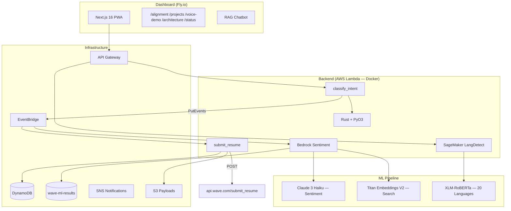

# Wave Application — Senior ML Engineer (LLM & Voice)

[](https://github.com/ericgitangu/wave/actions/workflows/ci.yml)
[](LICENSE)
[](backend/)
[](infra/)
[](dashboard/)

Polyglot submission for Wave's Senior Machine Learning Engineer role. Ships a working product as the application itself.

## Architecture



## Submission

The core deliverable — POST a JSON resume to Wave's API:

```python
# scripts/submit.py
ENDPOINT = "https://api.wave.com/submit_resume"
# Bearer token: wave_{country_code}_{any_chars}
DEFAULT_TOKEN = "wave_KE_ericgitangu"
```

The PWA dashboard pulls the same payload and renders it as interactive cards:

```typescript
// dashboard/src/app/api/submissions/route.ts
export async function GET() {
  return NextResponse.json({
    submissions: [{
      id: crypto.randomUUID().slice(0, 8),
      timestamp: '2026-02-24T00:00:00Z',
      status: 'acknowledged',
      endpoint: 'https://api.wave.com/submit_resume',
    }],
  })
}
```

## Structure

```
payload/resume.json            JSON payload for Wave API
scripts/
  submit.py                    Standalone submission (no infra needed)
  build-lambdas.sh             Full build + deploy pipeline
  sagemaker-scheduler.sh       Auto-start/stop (59min cap)
  teardown-sagemaker.sh        Manual teardown
backend/
  src/lib.rs                   PyO3 module registration (6 functions)
  src/submission.rs            Rust-native HTTP POST via reqwest
  src/voice.rs                 Tokenization + language detection (Swahili/English)
  src/bedrock.rs               Bedrock request/response serialization
  src/sagemaker.rs             SageMaker request/response serialization
  python/handler.py            Submission Lambda handler
  python/voice_handler.py      Voice classification + EventBridge publish
  python/bedrock_handler.py    Bedrock sentiment + embeddings Lambda
  python/sagemaker_handler.py  SageMaker language detection Lambda
  Dockerfile.lambda            Multi-stage Rust+PyO3 Docker build
  tests/                       pytest + Rust #[cfg(test)]
dashboard/
  app/                         Next.js 16 App Router pages
  components/                  SplashBanner, WhatsNew, SystemStatusCharts, etc.
  src/data/meta.json           Metafile driving all app identity, SEO
  src/context/                 AppStatusContext (30s polling, 6-service health)
infra/
  lib/submission-stack.ts      DynamoDB + Lambda + EventBridge + SNS + S3
  lib/voice-stack.ts           Lambda + API Gateway + EventBridge publish
  lib/bedrock-stack.ts         DynamoDB + Bedrock Lambda + EventBridge rules
  lib/sagemaker-stack.ts       SageMaker endpoint + Lambda + API Gateway
```

## Quick Start

```bash
# Run all Rust tests (22 tests)
make test

# Build Docker image locally
make build

# Deploy to AWS (build + push + CDK)
make deploy

# Start SageMaker endpoint (auto-stops in 59min)
make sagemaker-start

# Stop SageMaker immediately
make sagemaker-stop

# Dashboard dev server
make dashboard-dev
```

## Cost Management

SageMaker `ml.m5.large` costs ~$0.12/hr. **Never leave running.**

| Resource | Cost | Mitigation |
|----------|------|-----------|
| SageMaker ml.m5.large | ~$86/month if 24/7 | Auto-stop after 59min |
| Lambda (all functions) | ~$0/month | Pay-per-invocation |
| DynamoDB | ~$0/month | On-demand, 30-day TTL |
| Bedrock Claude Haiku | ~$0.00025/1K tokens | Pay-per-use |
| Bedrock Titan Embeddings | ~$0.0001/1K tokens | Pay-per-use |

```bash
# On-demand SageMaker (auto-stops in 59min)
bash scripts/sagemaker-scheduler.sh start
bash scripts/sagemaker-scheduler.sh status
bash scripts/sagemaker-scheduler.sh stop
```

## Design Decisions

| Decision | Rationale |
|---|---|
| Rust + PyO3 | Systems thinking + Wave's Python stack |
| Docker Lambda images | Compiled Rust .so in container, not raw Python zip |
| Bedrock Claude Haiku | Fastest/cheapest for sentiment, pay-per-token |
| Titan Embeddings V2 | Native AWS, 256-dim vectors, semantic search |
| XLM-RoBERTa on SageMaker | 20 languages incl. Swahili, French, Wolof |
| EventBridge fan-out | Decouple voice API from ML pipeline |
| 59min auto-stop | Cap SageMaker costs for demo-only usage |
| Next.js PWA | Offline-first matters in Africa |
| meta.json metafile | Single source of truth for identity/SEO |

## CI/CD

- **CI**: GitHub Actions — dashboard lint/typecheck/build, cargo test, pytest, CDK synth
- **CD**: Auto-deploy on push to main — Fly.io (frontend), CDK (backend)
- **Hooks**: Husky pre-commit (lint-staged), pre-push (typecheck + tests)

## Stack

Rust, Python 3.12 + mypy, TypeScript, React 19, Next.js 16, Tailwind v4, shadcn/ui, Recharts, Mermaid.js, Framer Motion, AWS CDK, DynamoDB, Lambda, EventBridge, API Gateway, Bedrock (Claude 3 Haiku, Titan Embeddings V2), SageMaker (XLM-RoBERTa), S3, Fly.io

## License

[MIT](LICENSE) — Eric Gitangu
